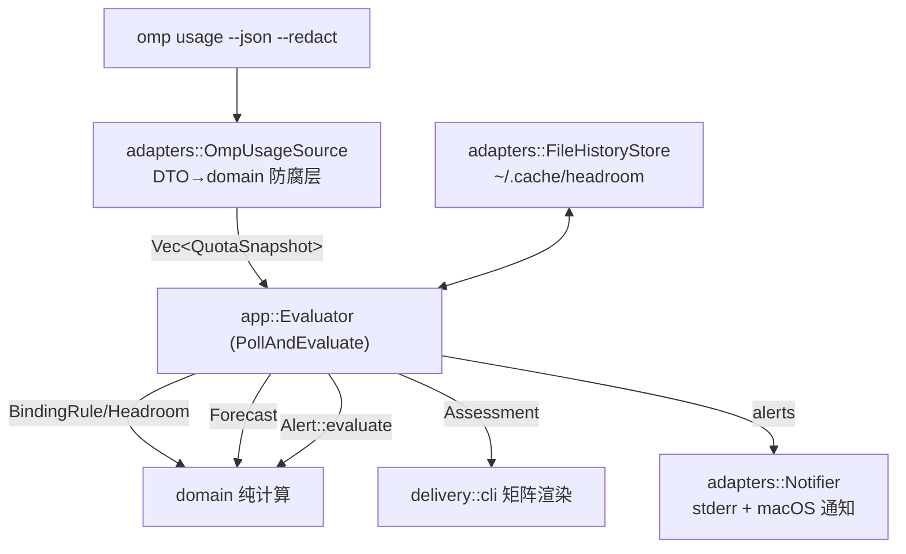
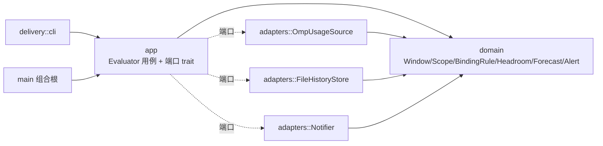

# 技术设计文档 (TDD) — headroom

## 0. 文档信息

| 项 | 内容 |
|---|---|
| 标题 | headroom：按模型/按规则的额度余量监控器技术设计 |
| 作者 | Main (Claude, requirement-orchestrator) |
| 状态 | Draft · 待评审 |
| 版本 | v0.1 |
| 创建日期 | 2026-09-03 |
| 关联 PRD | `docs/prd/PRD.md` |

## 1. 背景与问题陈述

参考项目 LimitDeck（Rust TUI）把订阅额度拍平为 `UsageWindow { remaining_percent, resets_at, status }` 的列表，**领域模型贫血**：没有「模型档位 / 约束规则 / 有效余量 / 预测 / 建议」等概念，因而只能展示、无法回答「哪个模型按其规则还剩多少、要不要换」。

本项目以**领域为中心**重建这套概念，语言与 LimitDeck 一致（Rust）。数据仍来自 `omp usage --json`——它比 Claude 官方状态行更细，返回带 `scope` 的分桶（`shared` 约束全模型、`tier` 只约束某档），这正是建模的关键输入。需求见 PRD，本文不复述。

## 2. 术语表

| 术语 | 含义 |
|---|---|
| Provider | 模型后端账户命名空间，如 `anthropic`、`openai-codex` |
| Account | Provider 下的一份凭证/workspace，脱敏为前缀（如 `f6*`） |
| Tier（档位） | 模型的额度档，如 Claude `fable`（顶配/Opus 级）、Codex `spark` |
| ModelClass | 观测单元：`Base`（仅受共享窗口约束的普通模型）或 `Tier(t)`（额外受档位专属窗口约束） |
| LimitWindow | 一个限额窗口（值对象）：id/label/scope/period/remaining/resetsAt/status |
| LimitScope | 窗口约束范围（和类型）：`Shared`（约束全部模型）\| `Tier(t)`（只约束档位 t） |
| QuotaSnapshot | 某账号某时刻全部窗口的一次读数（聚合根） |
| BindingRule | 领域服务：模型档位 → 约束它的窗口集 = 所有 Shared ∪ 匹配 Tier |
| Headroom（余量） | 值对象：某档位有效余量 = 约束窗口 remaining 最小值 + 瓶颈窗口 + 是否可用 |
| BurnRate / Forecast | 燃烧率（%/小时）与撞墙 ETA，由本地历史外推 |
| Alert | 告警（值对象）：级别 + 主体 + 原因 + 切换建议 |

### 2.1 标识前缀

| 前缀 | 含义 | 位置 |
|---|---|---|
| R# | Requirement | PRD §3 |
| AC# | Acceptance Criteria | PRD §4 |
| T# | Task | 本文 §8 / ledger |

## 3. 方案概览



架构风格：**领域中心 + 端口适配器（轻量六边形）**，与参考项目 bili2go 一致。依赖只由外向内指向领域，领域零 IO、可脱网单测。



## 4. 目录结构

```
headroom/
├── Cargo.toml
├── src/
│   ├── main.rs                组合根：解析参数、装配依赖、一次性/watch
│   ├── lib.rs                 模块树 + 公共导出
│   ├── domain/                领域层（纯，无 IO；统一语言）
│   │   ├── mod.rs
│   │   ├── model.rs           ProviderId/AccountId/Tier/ModelClass/Percent
│   │   ├── window.rs          LimitScope/WindowStatus/LimitWindow/QuotaSnapshot + BindingRule
│   │   ├── headroom.rs        Headroom::for_class（有效余量/瓶颈/可用性）
│   │   ├── forecast.rs        Sample/BurnRate/ExhaustionForecast
│   │   └── alert.rs           AlertLevel/Alert/Thresholds/evaluate
│   ├── app/                   应用层：用例 + 端口
│   │   ├── mod.rs
│   │   ├── ports.rs           UsageSource/HistoryStore/Notifier/Clock trait
│   │   └── evaluate.rs        Evaluator：poll→记录历史→算余量/预测/告警→Assessment
│   ├── adapters/              基础设施
│   │   ├── mod.rs
│   │   ├── omp_usage.rs       实现 UsageSource：跑 omp，DTO→domain（防腐层）
│   │   ├── history_file.rs    实现 HistoryStore：XDG cache JSON，采样+保留
│   │   ├── clock.rs           SystemClock
│   │   └── notify.rs          StderrNotifier(+可选 macOS osascript)
│   └── delivery/
│       ├── mod.rs
│       └── cli.rs             矩阵渲染（ANSI 上色）+ Assessment 可视化
└── tests/
    ├── fixtures/              真实 omp usage 输出（脱敏）
    ├── omp_usage_contract.rs  契约测试：fixture→domain
    └── evaluation.rs          端到端：注入假源→断言余量/告警
```

## 5. 领域模型（核心）

```rust
// domain/model.rs
pub struct Percent(u8);                 // 不变量 0..=100，构造夹紧
pub struct ProviderId(String);
pub struct AccountId(String);           // 脱敏前缀
pub struct Tier(String);                // "fable" / "spark" ...
pub enum ModelClass { Base, Tier(Tier) }// 观测单元

// domain/window.rs
pub enum LimitScope { Shared, Tier(Tier) }
pub enum WindowStatus { Ok, Unavailable }
pub struct LimitWindow {
    pub id: String, pub label: String,
    pub scope: LimitScope,
    pub period: Option<Duration>,
    pub remaining: Percent,
    pub resets_at: Option<SystemTime>,
    pub status: WindowStatus,
}
pub struct QuotaSnapshot {
    pub provider: ProviderId, pub account: AccountId,
    pub plan: Option<String>, pub fetched_at: SystemTime,
    pub windows: Vec<LimitWindow>,
}
impl QuotaSnapshot {
    // BindingRule：档位 → 约束窗口集
    pub fn binding_windows(&self, class: &ModelClass) -> Vec<&LimitWindow>;
    // 观测到的全部档位：Base + 有专属窗口的 tier
    pub fn model_classes(&self) -> Vec<ModelClass>;
}
```

**BindingRule（领域服务，纯函数）**
```
binding(class) = { w ∈ windows | w.scope==Shared
                                 ∨ (class==Tier(t) ∧ w.scope==Tier(t)) }
```

**Headroom（值对象）**
```rust
// domain/headroom.rs
pub struct Headroom {
    pub class: ModelClass,
    pub effective_remaining: Percent,   // = min(binding.remaining)
    pub bottleneck: LimitWindow,        // 取到最小值的那个窗口（副本）
    pub available: bool,                // 所有 binding.status==Ok 且 effective>0
}
impl Headroom { pub fn for_class(snap:&QuotaSnapshot, class:&ModelClass) -> Option<Headroom>; }
```

**Forecast（值对象，需历史）**
```rust
// domain/forecast.rs
pub struct Sample { pub at: SystemTime, pub remaining: Percent }
pub struct BurnRate { pub percent_per_hour: f64 }         // 线性拟合最近样本
pub struct ExhaustionForecast { pub eta: Option<Duration>, pub burn: Option<BurnRate> }
// 规则：<2 样本 或 非下降 ⇒ eta=None（不误报）；否则 eta = remaining / burn
```

**Alert（值对象 + 领域服务）**
```rust
// domain/alert.rs
pub enum AlertLevel { Info, Warn, Critical }
pub struct Thresholds { pub warn_pct: u8, pub critical_pct: u8, pub eta_warn: Duration }
pub struct Alert { pub level:AlertLevel, pub provider:ProviderId, pub account:AccountId,
                   pub subject:String, pub reason:String, pub suggestion:Option<String> }
// evaluate(snap, headrooms, forecasts, thresholds) -> Vec<Alert>
//  · 任一 binding 不可用            -> Critical
//  · effective<=critical_pct        -> Critical
//  · effective<=warn_pct 或 ETA<eta_warn -> Warn
//  · suggestion: 同 provider 内选 available 且余量最高的其它档位
```

## 6. 上游数据契约（omp usage，实测）

`omp usage --provider <p> --json --redact` 返回（节选，完整见 `tests/fixtures/`）:

```json
{
  "reports": [{
    "provider": "anthropic",
    "fetchedAt": 1788437412462,
    "limits": [
      { "id":"anthropic:5h",       "label":"Claude 5 Hour",
        "scope":{"shared":true},
        "window":{"durationMs":18000000,"resetsAt":1788442200000},
        "amount":{"remaining":72}, "status":"ok" },
      { "id":"anthropic:7d:fable", "label":"Claude 7 Day (Fable)",
        "scope":{"tier":"fable"},
        "window":{"durationMs":604800000},
        "amount":{"remaining":100}, "status":"ok" }
    ],
    "metadata": { "planType":"...", "accountId":"f6*", "email":"ta*" }
  }]
}
```

**映射规则（防腐层，DTO 止于 `adapters::omp_usage`）**
- `scope.shared==true` → `LimitScope::Shared`；否则 `scope.tier` → `LimitScope::Tier(t)`；两者皆缺 → 保守当 `Shared`。
- `amount.remaining` → `Percent`（夹紧 0..=100）。
- `status=="ok"` → `Ok`，否则 `Unavailable`。
- `window.durationMs`/`resetsAt` → `Duration`/`SystemTime`（缺省 None）。
- `metadata.accountId` 已脱敏前缀，直接作 `AccountId`；`planType` → `plan`；**email/org 一律不进入 domain**（隐私 R9）。

Codex 侧同构：`openai-codex:primary(5h,shared)` / `secondary(7d,shared)` / `spark:*(tier)`，无需为其写特例——`scope` 驱动映射。

## 7. 交付与运行

- CLI（v0）：`headroom [--provider P] [--warn 20] [--critical 5]`；`headroom watch [--interval 60]`。
- 渲染：每账号一张「ModelClass × 约束窗口」表——列出有效余量（上色）、瓶颈窗口、重置倒计时、ETA；末尾 alerts 区。
- watch：轮询→记录历史→重算→仅在**新增/升级**告警时 notify（避免刷屏）。
- Notifier：stderr 结构化行 + 可选 macOS `osascript` 桌面通知（best-effort，失败静默）。

## 8. 任务与里程碑

| Task | 内容 | 依赖 |
|---|---|---|
| T1 | domain：model/window/BindingRule | — |
| T2 | domain：headroom/forecast/alert | T1 |
| T3 | app：ports + Evaluator | T2 |
| T4 | adapters：omp_usage（防腐映射） | T1 |
| T5 | adapters：history_file/clock/notify | T3 |
| T6 | delivery：cli 矩阵渲染 | T3 |
| T7 | main 组合根 + 参数解析 | T3–T6 |
| T8 | 测试（契约 + 端到端）+ 发布物 | 全部 |

## 9. 备选方案与取舍

- **TUI vs CLI**：v0 选 CLI 矩阵——确定性输出、可脱终端冒烟测试；TUI 是纯 delivery 替换，领域/端口不变，留 v1。
- **数据源**：只经 omp（单一可信源、已脱敏、已聚合多账号），不直连各厂官方接口——避免重复 LimitDeck 的多适配器复杂度与凭证接触。
- **止步于「领域 + 用例 + 端口/适配器」**：无仓储/事件总线/CQRS——对只读监控属过度设计。
- **观测单元用 Tier 而非具体型号**：omp 只暴露到档位（tier），型号级归因需会话记账，划入 v2（PRD N3）。

## 10. 开放问题

- OQ1：omp 各 provider 的 tier 命名是否稳定（`fable`/`spark`）？——映射按 `scope` 泛化，不硬编码 tier 名，规避此风险。
- OQ2：历史采样频率与保留（暂定 ≤30 天、未变值 ≥15min 采一次），随实测调。
